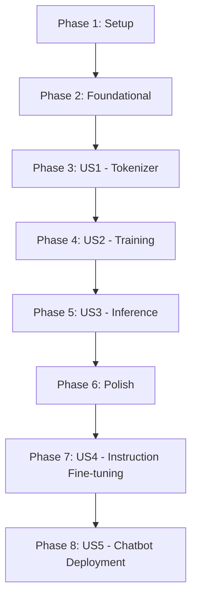

# Tasks: GPT-2 Pre-training on Recipe Dataset

**Input**: Design documents from `/specs/001-gpt2-pretrain-recipes/`
**Prerequisites**: plan.md (required), spec.md (required for user stories)

**Tests**: Prohibited by constitution. Do not add automated or manual testing tasks, artifacts, or dependencies.

**Organization**: Tasks are grouped by user story to enable independent implementation and delivery of each story.

## Format: `[ID] [P?] [Story] Description`

- **[P]**: Can run in parallel (different files, no dependencies)
- **[Story]**: Which user story this task belongs to (e.g., US1, US2, US3)
- Include exact file paths in descriptions

## Path Conventions

- **Notebook**: `notebooks/GPT2_Recipe_Pretraining.ipynb` (Google Colab notebook - requires Colab Pro for A100 GPU)
- **Outputs**: `outputs/tokenizer/`, `outputs/gpt2-recipe-checkpoints/` (Colab runtime storage, regenerated each session)
- **Platform**: Google Colab Pro with A100 GPU (40GB VRAM)

---

## Phase 1: Setup (Project Initialization)

**Purpose**: Create Google Colab notebook structure optimized for A100 GPU

- [X] T001 Create Google Colab notebook file at notebooks/GPT2_Recipe_Pretraining.ipynb
- [X] T002 Add Section 0.0: User Inputs cell with RECIPE_FILE_PATH variable in notebooks/GPT2_Recipe_Pretraining.ipynb
- [X] T003 [P] Add Section 0.1: Tokenizer Hyperparameters (TOKENIZER_CONFIG dict) in notebooks/GPT2_Recipe_Pretraining.ipynb
- [X] T004 [P] Add Section 0.2: Model Architecture Hyperparameters (MODEL_CONFIG dict) in notebooks/GPT2_Recipe_Pretraining.ipynb
- [X] T005 [P] Add Section 0.3: Training Hyperparameters (TRAINING_CONFIG dict) in notebooks/GPT2_Recipe_Pretraining.ipynb
- [X] T006 [P] Add Section 0.4: Inference Hyperparameters (INFERENCE_CONFIG dict) in notebooks/GPT2_Recipe_Pretraining.ipynb

---

## Phase 2: Foundational (Blocking Prerequisites)

**Purpose**: Environment setup and data loading that ALL user stories depend on

**⚠️ CRITICAL**: No user story work can begin until this phase is complete

- [X] T007 Add Section 1.1: Install Dependencies cell (!pip install -q transformers tokenizers datasets matplotlib seaborn) in notebooks/GPT2_Recipe_Pretraining.ipynb (Colab pre-installs torch)
- [X] T008 Add Section 1.2: Import Libraries cell (torch, transformers, tokenizers, matplotlib, seaborn) in notebooks/GPT2_Recipe_Pretraining.ipynb
- [X] T009 Add Section 1.3: GPU Availability Check cell (torch.cuda.is_available, verify A100 GPU, print VRAM) in notebooks/GPT2_Recipe_Pretraining.ipynb
- [X] T010 Add Section 2.1: Load Recipe Text File cell (read from RECIPE_FILE_PATH) in notebooks/GPT2_Recipe_Pretraining.ipynb
- [X] T011 Add Section 2.2: Data Exploration & Statistics cell (count recipes, length stats) in notebooks/GPT2_Recipe_Pretraining.ipynb
- [X] T012 Add Section 2.3: Visualize Recipe Length Distribution cell (seaborn histogram) in notebooks/GPT2_Recipe_Pretraining.ipynb

**Checkpoint**: Foundation ready - user story implementation can now begin

---

## Phase 3: User Story 1 - Train Custom BPE Tokenizer (Priority: P1) 🎯 MVP

**Goal**: Train a Byte Pair Encoding tokenizer from scratch on the recipe corpus with 30K vocabulary

**Independent Demonstration**: Run Section 3 cells; verify tokenizer saves to disk; encode/decode sample recipe text showing [BOS], [EOS], [UNK], [PAD] handling

### Implementation for User Story 1

- [X] T013 [US1] Add Section 3.1: Train BPE Tokenizer cell (BpeTrainer with vocab_size=30000, special_tokens) in notebooks/GPT2_Recipe_Pretraining.ipynb
- [X] T014 [US1] Add Section 3.2: Save Tokenizer to Disk cell (save vocab.json, merges.txt to outputs/tokenizer/) in notebooks/GPT2_Recipe_Pretraining.ipynb
- [X] T015 [US1] Add Section 3.3: Wrap in GPT2TokenizerFast cell (load saved tokenizer, set pad_token, bos_token, eos_token) in notebooks/GPT2_Recipe_Pretraining.ipynb
- [X] T016 [US1] Add Section 3.4: Tokenizer Validation Demo cell (encode sample recipe, decode back, print token IDs for special tokens) in notebooks/GPT2_Recipe_Pretraining.ipynb

**Checkpoint**: User Story 1 complete - tokenizer trained, saved, and validated via demonstration

---

## Phase 4: User Story 2 - Pre-train GPT-2 Model (Priority: P2)

**Goal**: Initialize GPT-2 Mini from random weights and train for 10 epochs with FP16 on Google Colab Pro A100 GPU (40GB VRAM)

**Independent Demonstration**: Execute training loop; observe loss decreasing in Trainer logs; verify 10 checkpoints saved to outputs/gpt2-recipe-checkpoints/

### Implementation for User Story 2

- [X] T017 [US2] Add Section 4.1: RecipeDataset Class Definition cell (torch.utils.data.Dataset with __init__, __len__, __getitem__) in notebooks/GPT2_Recipe_Pretraining.ipynb
- [X] T018 [US2] Add Section 4.2: Tokenize and Prepare Dataset cell (apply tokenizer with truncation/padding to 3000 tokens) in notebooks/GPT2_Recipe_Pretraining.ipynb
- [X] T019 [US2] Add Section 4.3: Create DataCollator cell (DataCollatorForLanguageModeling with mlm=False) in notebooks/GPT2_Recipe_Pretraining.ipynb
- [X] T020 [US2] Add Section 5.1: Configure GPT2Config cell (6 layers, 512 embed, 8 heads, vocab_size=30000) in notebooks/GPT2_Recipe_Pretraining.ipynb
- [X] T021 [US2] Add Section 5.2: Initialize GPT2LMHeadModel cell (from config, random weights) in notebooks/GPT2_Recipe_Pretraining.ipynb
- [X] T022 [US2] Add Section 5.3: Model Summary & Parameter Count cell (print model architecture, count params) in notebooks/GPT2_Recipe_Pretraining.ipynb
- [X] T023 [US2] Add Section 6.1: Configure TrainingArguments cell (fp16=True, batch_size=4, grad_accum=4, epochs=10, save_strategy='epoch', optimized for Colab Pro A100) in notebooks/GPT2_Recipe_Pretraining.ipynb
- [X] T024 [US2] Add Section 6.2: Initialize Trainer cell (model, train_dataset, args, data_collator) in notebooks/GPT2_Recipe_Pretraining.ipynb
- [X] T025 [US2] Add Section 6.3: Execute Training Loop cell (trainer.train()) in notebooks/GPT2_Recipe_Pretraining.ipynb
- [X] T026 [US2] Add Section 6.4: Visualize Training Loss Curve cell (matplotlib/seaborn plot of loss vs steps) in notebooks/GPT2_Recipe_Pretraining.ipynb

**Checkpoint**: User Story 2 complete - model trained for 10 epochs, checkpoints saved, loss curve visualized

---

## Phase 5: User Story 3 - Generate Recipe Text (Priority: P3)

**Goal**: Load trained model and generate coherent recipe continuations from prompts

**Independent Demonstration**: Run inference cell with "Ingredients: Chicken" prompt; verify 50+ tokens of recipe-style text generated

### Implementation for User Story 3

- [X] T027 [US3] Add Section 7.1: Load Trained Checkpoint cell (GPT2LMHeadModel.from_pretrained from outputs/gpt2-recipe-checkpoints/) in notebooks/GPT2_Recipe_Pretraining.ipynb
- [X] T028 [US3] Add Section 7.2: Generate Recipe from Prompt cell (encode "Ingredients: Chicken", model.generate with INFERENCE_CONFIG params, decode output) in notebooks/GPT2_Recipe_Pretraining.ipynb
- [X] T029 [US3] Add Section 7.3: Interactive Generation Examples cell (multiple prompts demonstrating model capabilities) in notebooks/GPT2_Recipe_Pretraining.ipynb

**Checkpoint**: User Story 3 complete - inference working, recipe text generated from prompts

---

## Phase 6: Polish & Cross-Cutting Concerns

**Purpose**: Cleanup, export, and documentation

- [X] T030 [P] Add Section 8.1: Save Final Model cell (save best checkpoint to outputs/gpt2-recipe-final/) in notebooks/GPT2_Recipe_Pretraining.ipynb
- [X] T031 [P] Add Section 8.2: Download Artifacts cell (google.colab.files.download helper for tokenizer and model files) in notebooks/GPT2_Recipe_Pretraining.ipynb
- [X] T032 Add notebook header markdown with title, description, Colab Pro setup instructions (Runtime > Change runtime type > A100) in notebooks/GPT2_Recipe_Pretraining.ipynb
- [X] T033 Add section divider markdown cells between major sections in notebooks/GPT2_Recipe_Pretraining.ipynb

**Checkpoint**: Phase 1 complete - all pre-training functionality implemented

---

## Phase 7: User Story 4 - Instruction Fine-tuning (Priority: P4)

**Goal**: Fine-tune the pre-trained model on Alpaca-style instruction data to enable conversational recipe generation

**Independent Demonstration**: Run Phase 2 cells; provide instruction like "Give me a recipe for chocolate cake"; verify model generates relevant recipe response

### Implementation for User Story 4

- [X] T034 [US4] Add Phase 2 header markdown cell explaining instruction fine-tuning goal in notebooks/GPT2_Recipe_Pretraining.ipynb
- [X] T035 [US4] Add Section 9.1: Phase 2 User Inputs cell (INSTRUCTION_FILE_PATH, PRETRAINED_MODEL_PATH) in notebooks/GPT2_Recipe_Pretraining.ipynb
- [X] T036 [US4] Add Section 9.2: Fine-tuning Hyperparameters cell (FINETUNE_CONFIG dict with lower LR, fewer epochs) in notebooks/GPT2_Recipe_Pretraining.ipynb
- [X] T037 [US4] Add Section 10.1: Load Pre-trained Model & Tokenizer cell (from Phase 1 output) in notebooks/GPT2_Recipe_Pretraining.ipynb
- [X] T038 [US4] Add Section 11.1: Dataset Validation Function cell (validate_instruction_dataset for Alpaca JSONL) in notebooks/GPT2_Recipe_Pretraining.ipynb
- [X] T039 [US4] Add Section 11.2: Load and Validate Instruction Dataset cell (report errors, preview samples) in notebooks/GPT2_Recipe_Pretraining.ipynb
- [X] T040 [US4] Add Section 11.3: Instruction Formatting Function cell (format_instruction with ### Instruction/Response template) in notebooks/GPT2_Recipe_Pretraining.ipynb
- [X] T041 [US4] Add Section 11.4: InstructionDataset Class Definition cell (torch.utils.data.Dataset for instruction data) in notebooks/GPT2_Recipe_Pretraining.ipynb
- [X] T042 [US4] Add Section 11.5: Create Instruction Dataset cell (instantiate with FINETUNE_CONFIG max_seq_length) in notebooks/GPT2_Recipe_Pretraining.ipynb
- [X] T043 [US4] Add Section 12.1: Fine-tuning TrainingArguments cell (LR=1e-5, epochs=3, warmup_ratio) in notebooks/GPT2_Recipe_Pretraining.ipynb
- [X] T044 [US4] Add Section 12.2: Initialize Fine-tuning Trainer cell (ft_trainer with ft_model, instruct_dataset) in notebooks/GPT2_Recipe_Pretraining.ipynb
- [X] T045 [US4] Add Section 12.3: Execute Fine-tuning cell (ft_trainer.train()) in notebooks/GPT2_Recipe_Pretraining.ipynb
- [X] T046 [US4] Add Section 12.4: Plot Fine-tuning Loss Curve cell (matplotlib plot of fine-tuning loss) in notebooks/GPT2_Recipe_Pretraining.ipynb
- [X] T047 [US4] Add Section 12.5: Save Fine-tuned Model cell (save to gpt2_recipe_instruct_final/) in notebooks/GPT2_Recipe_Pretraining.ipynb
- [X] T048 [US4] Add Section 13.1: Instruction-following Generation Function cell (generate_from_instruction) in notebooks/GPT2_Recipe_Pretraining.ipynb
- [X] T049 [US4] Add Section 13.2: Example Generations cell (demonstrate with multiple instruction prompts) in notebooks/GPT2_Recipe_Pretraining.ipynb
- [X] T050 [US4] Add Section 13.3: Interactive Chat Loop cell (while True input loop for user interaction) in notebooks/GPT2_Recipe_Pretraining.ipynb
- [X] T051 [US4] Add Section 14.1: Download Fine-tuned Model cell (zip and download instruct model) in notebooks/GPT2_Recipe_Pretraining.ipynb
- [X] T052 [US4] Add Section 14.2: Complete Pipeline Summary cell (display both phases summary) in notebooks/GPT2_Recipe_Pretraining.ipynb

**Checkpoint**: User Story 4 complete - instruction fine-tuning implemented, interactive inference working

---

## Phase 8: User Story 5 - Chatbot Deployment (Priority: P5)

**Goal**: Deploy the fine-tuned recipe model as an interactive Streamlit chatbot accessible via ngrok tunneling from Google Colab

**Independent Demonstration**: Run Colab deployment commands; access ngrok public URL; type recipe request; verify professional chat interface displays responses

### Implementation for User Story 5

- [X] T053 [US5] Create app.py with Streamlit chatbot application (st.chat_message, sidebar controls, @st.cache_resource model loading)
- [X] T054 [US5] Implement chat history persistence in app.py using st.session_state
- [X] T055 [US5] Add sidebar generation controls (temperature slider 0.1-1.0, max length slider 100-1000) in app.py
- [X] T056 [US5] Create colab_deploy.py with ngrok tunnel setup and Streamlit launch commands
- [X] T057 [US5] Create requirements.txt with deployment dependencies (torch, transformers, streamlit, pyngrok)
- [X] T058 [US5] Add GPU/CUDA detection in app.py for automatic device selection

**Checkpoint**: User Story 5 complete - chatbot deployed with professional UI and public URL access

---

## Dependencies & Execution Order

### Phase Dependencies

- **Setup (Phase 1)**: No dependencies - creates notebook structure
- **Foundational (Phase 2)**: Depends on Setup - environment and data loading
- **US1 Tokenizer (Phase 3)**: Depends on Foundational - needs loaded data
- **US2 Training (Phase 4)**: Depends on US1 - needs trained tokenizer
- **US3 Inference (Phase 5)**: Depends on US2 - needs trained model
- **Polish (Phase 6)**: Depends on US3 - all Phase 1 functionality complete
- **US4 Instruction Fine-tuning (Phase 7)**: Depends on Phase 6 - needs saved pre-trained model
- **US5 Chatbot Deployment (Phase 8)**: Depends on Phase 7 - needs fine-tuned model

### User Story Dependencies

- **User Story 1 (P1)**: Depends on Phase 2 completion (data must be loaded)
- **User Story 2 (P2)**: Depends on User Story 1 completion (tokenizer required)
- **User Story 3 (P3)**: Depends on User Story 2 completion (trained model required)
- **User Story 4 (P4)**: Depends on User Story 3 completion (pre-trained model must be saved)
- **User Story 5 (P5)**: Depends on User Story 4 completion (fine-tuned model required for deployment)

> ⚠️ **Note**: User stories are sequential for this feature due to data pipeline dependencies (data → tokenizer → model → inference → instruction fine-tuning → chatbot deployment)

### Parallel Opportunities

Within phases, tasks marked [P] can run in parallel:
- **Phase 1**: T003, T004, T005, T006 (hyperparameter config cells) can be added in parallel
- **Phase 6**: T030, T031 (export cells) can be added in parallel

---

## Implementation Strategy

### MVP First (User Story 1 Only)

1. Complete Phase 1: Setup (T001-T006)
2. Complete Phase 2: Foundational (T007-T012)
3. Complete Phase 3: User Story 1 (T013-T016)
4. **STOP and VALIDATE**: Run tokenizer cells, verify encode/decode works
5. MVP complete - tokenizer trained from scratch on recipe corpus

### Incremental Delivery

1. Setup + Foundational → Notebook structure ready
2. Add User Story 1 → Demonstrate tokenizer → Deliverable: trained BPE tokenizer
3. Add User Story 2 → Demonstrate training → Deliverable: trained GPT-2 model
4. Add User Story 3 → Demonstrate inference → Deliverable: recipe generator
5. Add Phase 6 Polish → Final Phase 1 notebook with documentation
6. Add User Story 4 → Demonstrate instruction-following → Deliverable: recipe assistant
7. Add User Story 5 → Demonstrate chatbot deployment → Deliverable: web-accessible recipe chatbot

### Execution Summary

| Phase | Tasks | Parallel | Sequential | Estimated Cells/Files |
|-------|-------|----------|------------|----------------------|
| Setup | 6 | 4 | 2 | 5 |
| Foundational | 6 | 0 | 6 | 6 |
| US1 Tokenizer | 4 | 0 | 4 | 4 |
| US2 Training | 10 | 0 | 10 | 10 |
| US3 Inference | 3 | 0 | 3 | 3 |
| Polish | 4 | 2 | 2 | 4 |
| US4 Instruction Fine-tuning | 19 | 0 | 19 | 25 |
| US5 Chatbot Deployment | 6 | 0 | 6 | 3 files |
| **Total** | **58** | **6** | **52** | **57 cells + 3 files** |

---

## Validation Checklist

- [X] All 58 tasks follow checklist format: `- [ ] [TaskID] [P?] [Story?] Description with file path`
- [X] Each user story has clear independent demonstration criteria
- [X] No test-related tasks (constitution compliance)
- [X] All tasks reference exact file path (notebooks/GPT2_Recipe_Pretraining.ipynb or standalone files)
- [X] Dependencies documented in mermaid diagram
- [X] MVP scope identified (User Story 1: Tokenizer training)
- [X] Phase 2 (Instruction Fine-tuning) fully documented with tasks T034-T052
- [X] Phase 3 (Chatbot Deployment) fully documented with tasks T053-T058
